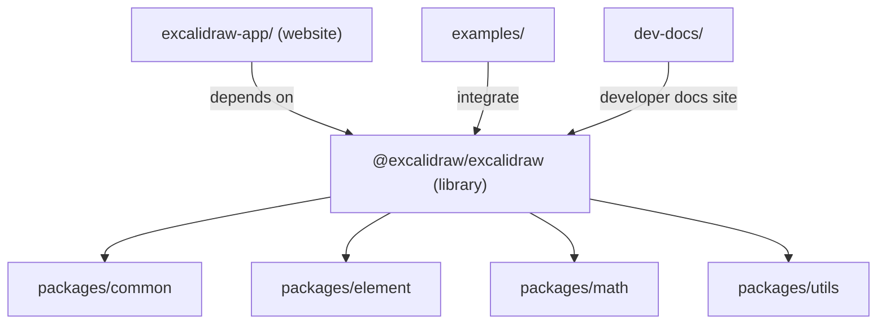

# Repo tour (monorepo map)

Excalidraw is a monorepo. The most important distinction is:

- **`excalidraw-app/`**: the full web app (excalidraw.com)
- **`packages/excalidraw/`**: the reusable React component library published as `@excalidraw/excalidraw`

## Mental model

## Where should my change go?

### `excalidraw-app/`

Use this for:

- App-specific UI, routing, hosting glue, analytics, deploy config
- Production behaviors that shouldn’t ship in the library

### `packages/excalidraw/`

Use this for:

- Editor behaviors and UI that belong in the reusable package
- API surface consumed by integrators (props, exported utilities, types)

### `packages/*` (shared internals)

Use this for:

- Cross-cutting utilities, types, element model, math helpers
- Functionality reused by both the app and the library

## “I’m lost” shortcuts

- Search for the UI component or string you see in the app.
- Track data flow starting from the interaction handler (pointer/keyboard) to state updates.
- If your change affects integrators, validate it in **both**:
  - `excalidraw-app/` (real app)
  - an `examples/` integration (consumer perspective)

