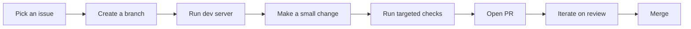

# Development workflow

This page describes the day-to-day loop for contributing safely in a large TypeScript monorepo.

## The happy path loop



## Branching and remotes (recommended)

If you’re working from a fork, configure `upstream` once:

```bash
git remote add upstream https://github.com/excalidraw/excalidraw.git
git fetch upstream
```

Then keep your fork’s default branch up to date:

```bash
git checkout master
git pull --rebase upstream master
```

## Development modes

### Local Node/Yarn (most common)

```bash
yarn
yarn start
```

### CodeSandbox (fastest zero-setup)

The repo supports CodeSandbox for quick edits and PRs:

- `https://codesandbox.io/p/github/excalidraw/excalidraw`

### Docker Compose (if you don’t want a Node environment)

```bash
docker-compose up --build -d
```

## Working effectively in a monorepo

- **Prefer small PRs**: easier review, less merge conflict risk.
- **Keep changes scoped**: avoid drive-by refactors unless necessary.
- **Choose the right package boundary**:
  - app behavior → `excalidraw-app/`
  - reusable editor behavior/API → `packages/excalidraw/`
  - shared internals → `packages/*`

## Collaboration / room server

If you’re working on real-time collaboration features, you’ll generally need the room server locally:

- [`excalidraw-room`](https://github.com/excalidraw/excalidraw-room)

